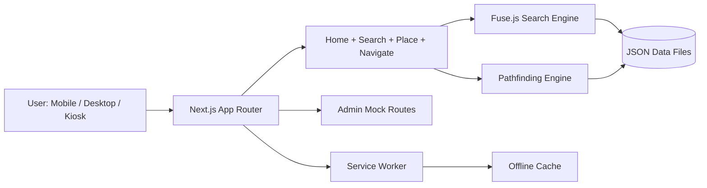

# Architecture Overview

## Data Flow

1. UI loads static JSON via `src/lib/data.ts`.
2. Search uses Fuse.js weighted fields.
3. Navigation computes shortest route with accessibility filter.
4. Service worker caches app shell and key pages for offline fallback.
